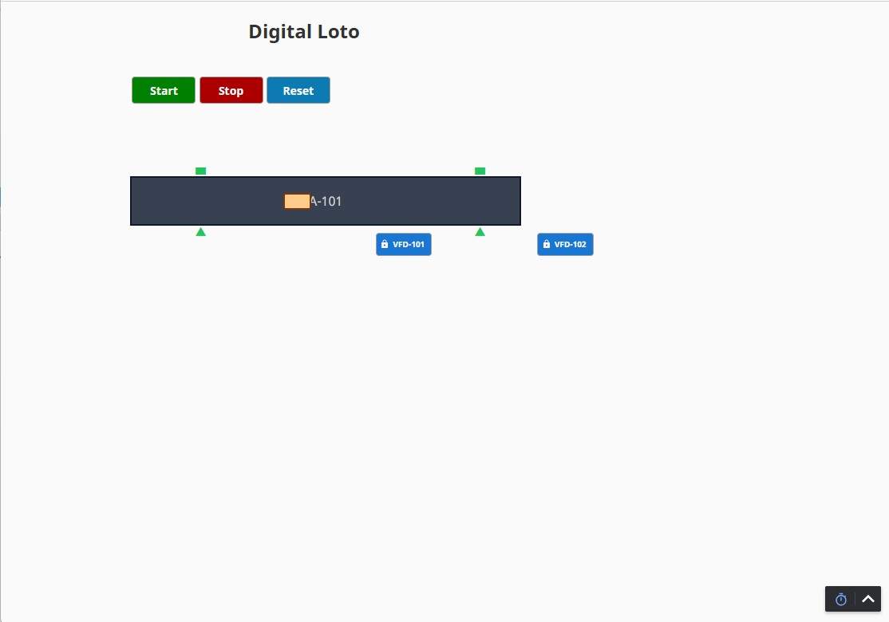

# vLock Digital LOTO for Ignition

vLock is a **Digital Lockout/Tagout (LOTO) concept project built with Ignition Perspective**.

It demonstrates how Ignition can track equipment lock status, prevent restart while LOTO is active, capture the user/reason/time, require a reset after release, and log LOTO events to PostgreSQL.
## Problem

Physical LOTO remains the primary safety control, but equipment status, ownership,
reason, timing, and return-to-service information may also be tracked through paper
tags or separate operational processes.

## Approach

vLock adds a digital workflow in Ignition around the physical LOTO process.
It provides equipment-status visibility, user ownership, event history, restart
management, and audit traceability while keeping physical LOTO procedures as the
required safety control.
## Features

* Independent LOTO for VFD-101 and VFD-102
* Apply / Release workflow
* Required LOTO reason
* Ignition user capture
* Applied timestamp
* Equipment start inhibition
* Reset required after release
* PostgreSQL event logging
* Reusable Perspective popup with dynamic equipment paths

## Workflow

```text
Equipment Running
      ↓
Apply LOTO
      ↓
Capture User + Reason + Time
      ↓
LOTO Active
      ↓
Equipment Stopped / Start Blocked
      ↓
Release LOTO
      ↓
Reset Required
      ↓
Reset
      ↓
Equipment Available
```

## Screenshots

### System Overview



### Apply LOTO


### LOTO Active


## Technology

* Ignition 8.3
* Perspective
* Python/Jython
* Ignition Tags
* Named Queries
* PostgreSQL
* Docker

## Database

The `database` folder contains the PostgreSQL/Docker setup used by the demo.

LOTO events record information such as:

* Equipment
* Action
* Username
* Reason
* Timestamp

## Safety Notice

**vLock is a concept/reference project and is not a safety-rated system.**

It does not replace physical lockout/tagout procedures, energy-isolating devices, safety PLCs, safety relays, or an approved hazardous-energy control program.

Any real-world implementation must be designed and validated according to the applicable safety requirements and site procedures.

## Author

**Ender Celik**
 ec.endercelik@gmail.com
