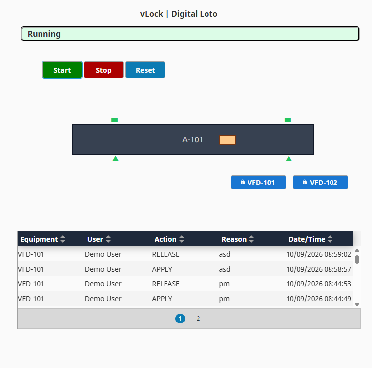
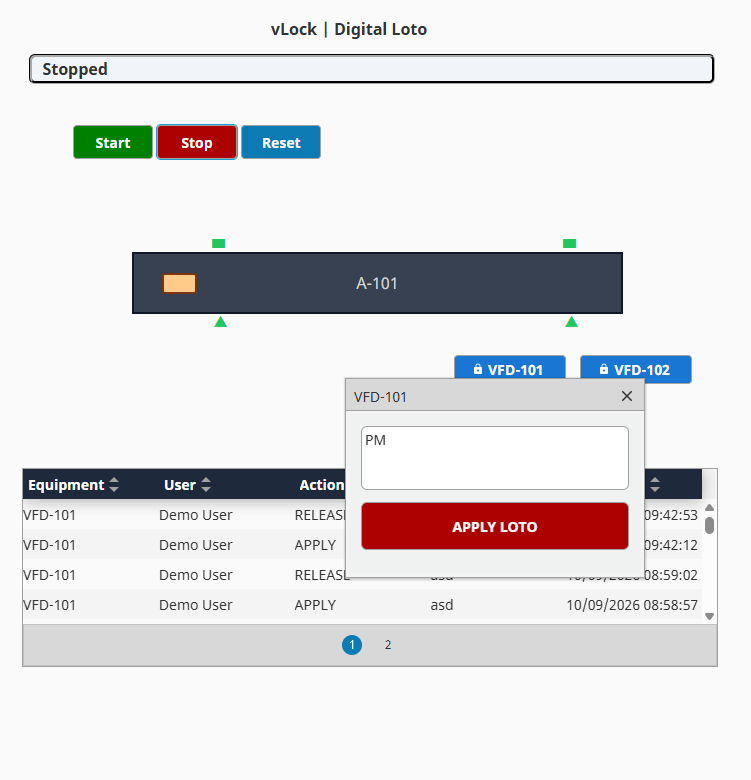
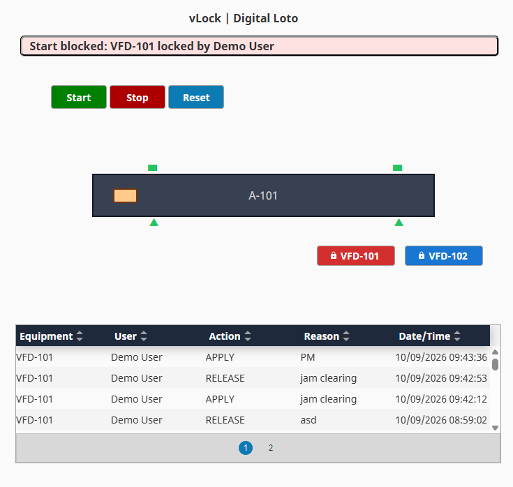
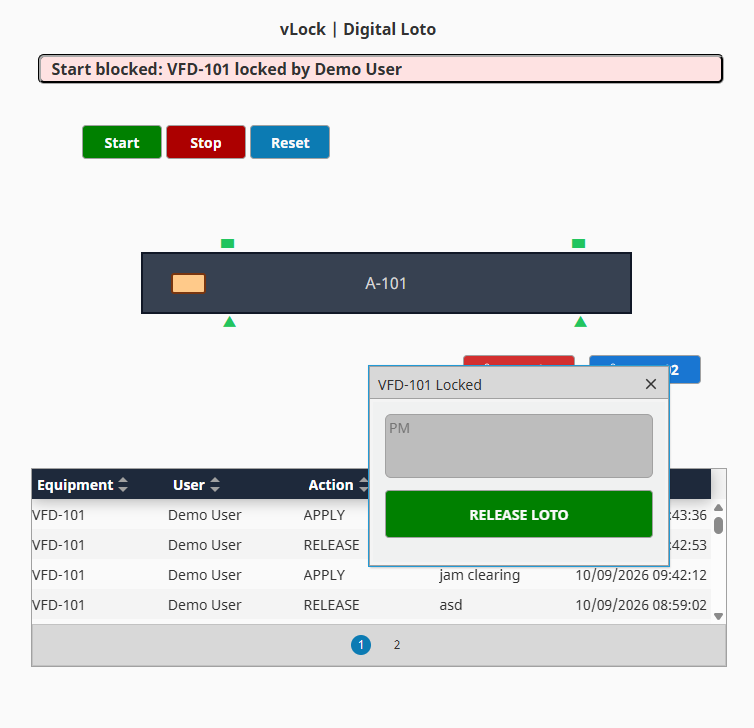

# vLock - Digital LOTO for Ignition

vLock demonstrates a digital "Do Not Operate" status for equipment. Applying a lock displays the user and reason, blocks Start, and records the event in PostgreSQL. After release, Reset is required before restarting.

Version 1.0.0. Requires Ignition 8.3, Perspective, and PostgreSQL. No PLC is required.

## Installation

1. Run `database-schema.sql` in PostgreSQL.
2. Create an Ignition database connection named exactly `vlock-db` with read/write access.
3. Import `vlock-digital-loto.zip` into an Ignition project.
4. Import `vlock-udts.json` into UDT Definitions and `vlock-tags.json` into Tags, both at the root of `default`.
5. Map `/vlock` to `Exchange/VLock/MainPage` and save.
6. Open `/data/perspective/client/<project-name>/vlock` on your Gateway.

Unsigned sessions use `Demo User`.

## Screenshots

## Scope

This demonstration is not a safety-rated energy-isolation system and does not replace physical lockout/tagout procedures or approved hazardous-energy control methods.

## License

MIT License. Copyright (c) 2026 Ender Celik.
